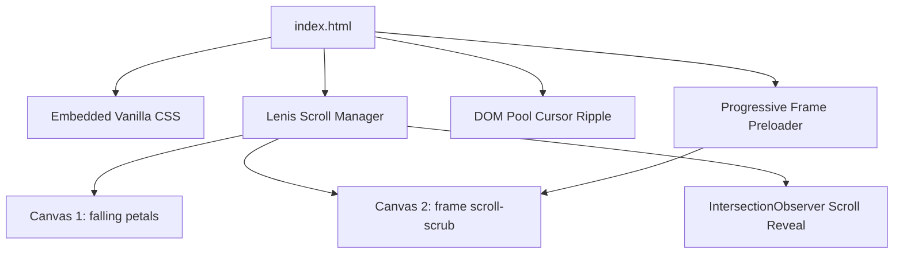

# 🛠️ Velmori Gifts - Developer Reference & Build Specification

This document provides a technical overview of the **Velmori Gifts** codebase. It outlines core architectures, JavaScript systems, CSS structures, and critical guidelines for developers (both human and AI agents) to understand and maintain the project without introducing regressions.

---

## 🏗️ Technical Architecture Overview

Velmori Gifts is designed as an ultra-high performance, single-page, static web experience. 

It does not use a bundler or compiler (Vite/Webpack) to keep load times absolute. Instead, it relies on modern browser APIs to deliver premium animation physics at 60fps on a budget:



---

## ⚡ Core JavaScript Subsystems

### 1. Progressive Animation Frame Preloader (Critical for FCP)
To power the canvas-scrub animation, the page renders 240 compressed frames (`ezgif-frame-001.jpg` to `ezgif-frame-240.jpg`). 

To avoid network bottlenecking on page load, we use a **Progressive Preloading** strategy:
- **Phase 1**: Load the first `10` frames synchronously inside the preloader loop to display the initial visible state immediately.
- **Phase 2**: After `500ms`, a chunked loader takes over, querying `requestIdleCallback` (or fallback `setTimeout`) to load remaining frames in batches of `15`. This prevents network congestion and keeps browser threads free.
- **ImageBitmaps**: Frames are converted to GPU-resident `ImageBitmap` formats using `createImageBitmap(img)`. When drawing to canvas, the browser skips CPU-to-GPU memory transfer, allowing instant, stutter-free frames.

```javascript
// Progressive Preloader Logic
const initialLoad = 10;
for (let i = 0; i < Math.min(initialLoad, TOTAL_FRAMES); i++) {
  loadFrame(i);
}

// Background idle chunk loader
setTimeout(() => {
  let currentIdx = initialLoad;
  function loadChunk() {
    const chunkEnd = Math.min(currentIdx + 15, TOTAL_FRAMES);
    for (let i = currentIdx; i < chunkEnd; i++) {
      loadFrame(i);
    }
    currentIdx = chunkEnd;
    if (currentIdx < TOTAL_FRAMES) {
      if (window.requestIdleCallback) {
        window.requestIdleCallback(loadChunk);
      } else {
        setTimeout(loadChunk, 100);
      }
    }
  }
  loadChunk();
}, 500);
```

### 2. High-Performance Cursor Ripple Trail (DOM Object Pool)
To bypass the memory allocation and Garbage Collection (GC) pauses associated with generating hundreds of cursor-trail divs, a **fixed DOM object pool** is implemented:
- A flat pool of `40` `.ripple-ring` divs is instantiated into `#ripple-container` during DOM load.
- When the mouse moves past a threshold distance of `40px`, the next pool element is repositioned to `e.clientX` / `e.clientY` and marked active.
- An animation loop updates scale and opacity using light inline styling (`opacity: 1 - Math.pow(r.age, 1.2)`), avoiding layout thrashing.
- Unused elements are styled with `opacity: 0` instead of being removed from the DOM.

### 3. Lenis Smooth Scroll Manager
Scroll behaviors are hooked into Lenis for premium, inertia-based momentum:
- Custom configuration handles scroll physics:
  ```javascript
  const lenis = new Lenis({
    duration: 1.1,
    easing: (t) => Math.min(1, 1.001 - Math.pow(2, -10 * t)),
    smoothWheel: true,
    smoothTouch: false, // Touch disabled to prevent native scroll collision on mobile
  });
  ```
- Native CSS scrolling is disabled (`html { scroll-behavior: auto !important; }`) to ensure no race conditions.

---

## 🎨 Layout & CSS Framework Specifications

### Typography Tokens
- **Headings**: `Cormorant Garamond` (classic serif, font-weight: 600, used for luxury branding, large italic headings).
- **Body & Labels**: `Lato` (sans-serif, weights: 300, 400, 700, used for statistics, product body text, navigation elements).

### Glassmorphism System
To maintain the warm luxury card panels, elements utilize CSS backing filters:
```css
background: rgba(255, 255, 255, 0.45);
backdrop-filter: blur(25px) saturate(190%);
-webkit-backdrop-filter: blur(25px) saturate(190%);
border: 1px solid rgba(255, 255, 255, 0.5);
```

---

## 🔍 SEO & Web Vitals Optimizations

### Page Speed Guidelines
1. **Google Web Fonts**: Always connect with a preconnect hint to ensure text doesn't display raw browser styles:
   ```html
   <link rel="preconnect" href="https://fonts.googleapis.com">
   <link rel="preconnect" href="https://fonts.gstatic.com" crossorigin>
   ```
2. **Lazy Loading Assets**: All product images and avatars use standard `loading="lazy"` and `decoding="async"`. DO NOT remove these from the markup.
3. **Canvas Drawing**: Context creation for `frame-canvas` explicitly sets `{ alpha: false }`. This signals to the browser's compositor that the canvas is opaque, optimizing drawing pipelines.

### Search Engine Optimization (SEO)
- **Canonicalization**: The site contains `<link rel="canonical" href="https://velmori-gifts.netlify.app/">`. Keep this updated if the domain shifts.
- **Open Graph Metadata**: Ensure Open Graph and Twitter Card tags correspond to correct asset links (`images/logo.png`) to support rich visual previews on mobile sharing apps.
- **Sitemap**: When adding new pages or anchors, ensure `sitemap.xml` is updated.

---

## ⚙️ Deployment Instructions (Netlify)

This project is configured as a fully static application.

### Netlify Settings
*   **Build Command**: None (leave empty)
*   **Publish Directory**: `.` (root directory)
*   **Headers Configuration**:
    Add cache-control headers on Netlify for images and frame directories (`/frames/*` and `/images/*`) to cache assets aggressively (`max-age=31536000`), reducing repeat load times to zero.

---

## 🛠️ Developer Checklist (Strict Guidelines)

- [ ] **Do not use tailwind or other compilers** unless explicitly requested. Maintain Vanilla CSS within the head block.
- [ ] **Do not modify the frame load batch values** below `15` or above `30` without benchmarking network saturation on 3G speeds.
- [ ] **Maintain DOM Pool Integrity**: Never dynamically `createElement` or `remove` trail components in loop scopes. Reuse pre-instantiated arrays.
- [ ] **Alt Tags**: Always provide descriptive `alt` texts on images for search crawler readability.
